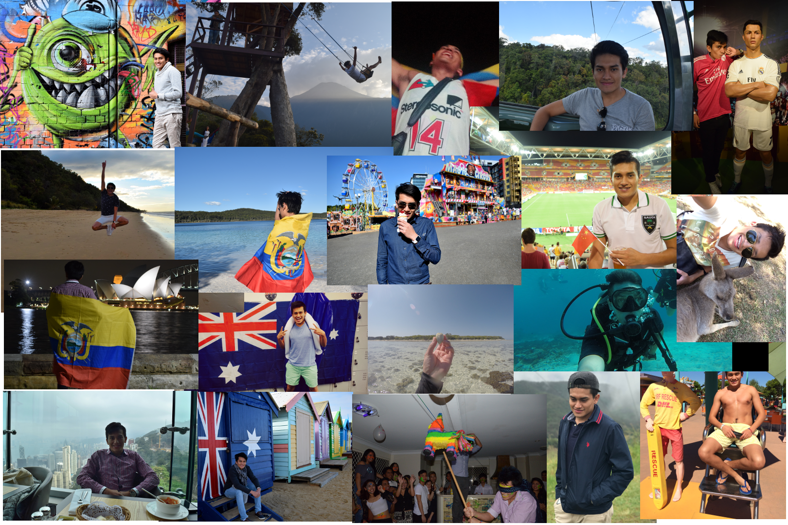
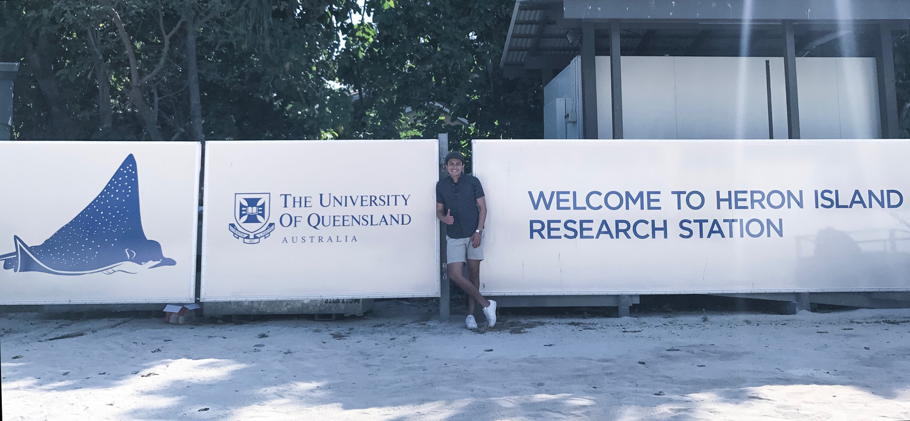

+++
# A Demo section created with the Blank widget.
# Any elements can be added in the body: https://sourcethemes.com/academic/docs/writing-markdown-latex/
# Add more sections by duplicating this file and customizing to your requirements.

widget = "blank"  # See https://sourcethemes.com/academic/docs/page-builder/
headless = true  # This file represents a page section.
active = true # Activate this widget? true/false
weight = 20  # Order that this section will appear.

title = ""
subtitle = ""

[design]
  # Choose how many columns the section has. Valid values: 1 or 2.
  columns = "1"

[design.background]
  # Apply a background color, gradient, or image.
  #   Uncomment (by removing `#`) an option to apply it.
  #   Choose a light or dark text color by setting `text_color_light`.
  #   Any HTML color name or Hex value is valid.

  # Background color.
  # color = "navy"
  
  # Background gradient.
  # gradient_start = "DeepSkyBlue"
  # gradient_end = "SkyBlue"
  
  # Background image.
  image = ""  # Name of image in `static/img/`.
  image_darken = 0.6  # Darken the image? Range 0-1 where 0 is transparent and 1 is opaque.

  # Text color (true=light or false=dark).
  text_color_light = false

[design.spacing]
  # Customize the section spacing. Order is top, right, bottom, left.
  padding = ["20px", "0", "20px", "0"]

[advanced]
 # Custom CSS. 
 css_style = ""
 
 # CSS class.
 css_class = "mini"
+++

I am originally from Ambato, Ecuador. During my education, I have been exposed to different cultures. I did my primary school and lived for eight years in Barcelona, Spain. I learned Catalan and had friends from all over the world. My family and I returned to Ecuador, where I completed high school. After finishing high school, I obtained one of the highest scores in a national test for tertiary education. I moved to Australia to get my Bachelors's degree; first, I completed the UQ's foundation year at International Education Services and then enrolling at the University of Queensland, Australia. I graduated with a bachelor's in Science and a dual major in Marine Biology and Genetics. Studying this career was one of my best choices in life. I was not familiar with the field but living in Australia gave me exposure to nature, marine ecosystems, ecology in general. At the university, world leaders in the field of marine biology and conservation became mentors with lectures that complemented field trips, laboratory experiments, and more. It was a remarkable experience that built solid foundations for my future vocation.

After my bachelor's degree, it was an indispensable requirement to continue my personal and academic formation. I enrolled in Beijing Normal University in 2018 for a master's degree in Environmental Science. It was a new culture, new environment, and a different education system. Two years were fast after spending the last six months under locked down. University regulations kept us for five months in close management. During those weeks, I decided to learn more about R. I was familiar with it from UQ, yet if you don't use it often, you forget about it. Apart from that, I covered different applications and tools. I was fascinated, and now I practice and work with R almost every day.

Seeking more extensive and solid academic experiences let me enroll for a doctoral degree. Education at this point is a lot more independent; I enjoyed working that way, learning the topics that I want to improve and be familiar with. Similarly, I have the skills to self-educated thanks to all the online resources available. 

My research focused on environmental pollution, pesticides, and heavy metals quantification, similarly ecological and human health risk assessments. I consider myself a science person, and I wish to apply my R knowledge in many fields.  My journey just began, but I have great expectations for my future career as I have a multicultural formation and many transferrable skills. 

Thank you so much for reading.  If you have some projects or ideas to collaborate on, please, contact me to work together.
